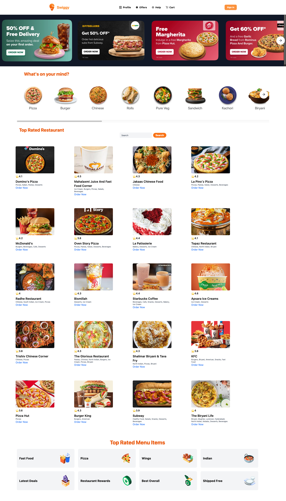

# Swiggy-api-app 

## Project GIF

# Image
[](https://mermaid.live/edit#pako:eNqFk02PmzAQhv8K8rEiBEz4PFRaJSu1UqtK3WoPbXpw7AGsBYyMSZtG-e81dgop2aqcPM_7ztgz2GdEBQOUo14RBTtOSkma1RHvW0d_3958d1art8470YAl48qgJyCSVrwtLZ9CI-7gIIaWTuoc_z_3gyBskq6BzRoohb6_Fx6lFPJaynoMfs_q66GNYcFunZ9Bdz9I0qodKMJr61hSY31g7IvYEqmsZwqNOPMZVUBfxLDE4xhzZ1vrzp2HunYKKZrb9GuW8X6SDORWtAWXDVFctNZzh28KG83ZiqarQS3_3DOHH3NvVvyb2XF3QHnB6dJ6z18bzD9coyHXk23EEe6a_jOc13ZGLmpAN8qZvqvnMWGPVAX6WqJcLxmRL3u0by_aRwYlnk4tRXlB6h5cNHRsvtsL-si4EnKCtb5WoMMzUqdufBYl75WuScc5lyMfZK1xpVTX5-v1KHslV9Vw8Kho1j1nlW6jOmbxOsZxSnAIcRKSKAwZPQRZWuBNULDEDzBBl4uLOtJ-FUKfSskBTDhu8hPlWeCl0SZIMj9M_CiJMxedUB5hL8abTZLEaZQEoY91iV8m3_fSME5T7Ps4w2mSZamLwDT30T5w884vvwETK0Ao)

# Features:
  
  - Fetch Restaurants from Swiggy-Live-API 
  - Config Driven UI
  - Searching restaurants 
  - Add food items to cart
  - Routing
  - Responsive

# Tech Stack
 
  - Reactjs
  - TailwindCss
  - Redux
  - parcel and babel
  - Formik
  - using Swiggy Public Api

# Installation

- Clone the repository
- Go to the project directory and run : `npm install ` for node module.
- And to run project : `npm start`
- Add `Cors` Extention into your browser & you're good to go.
